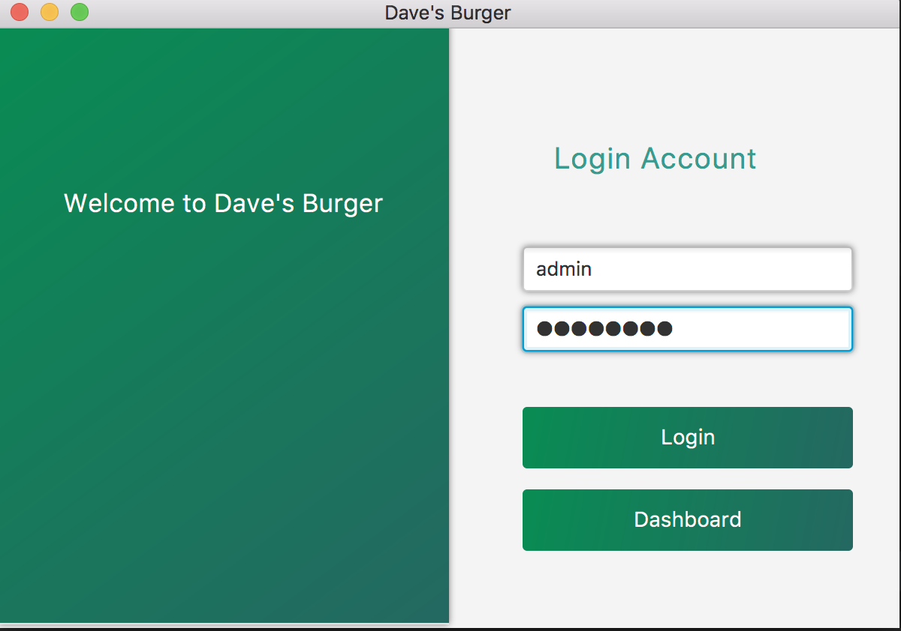
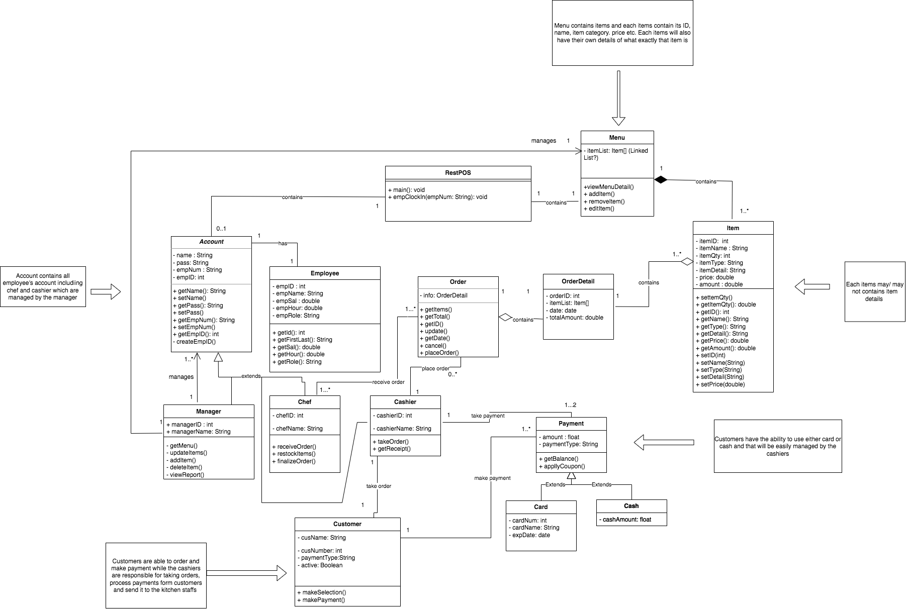
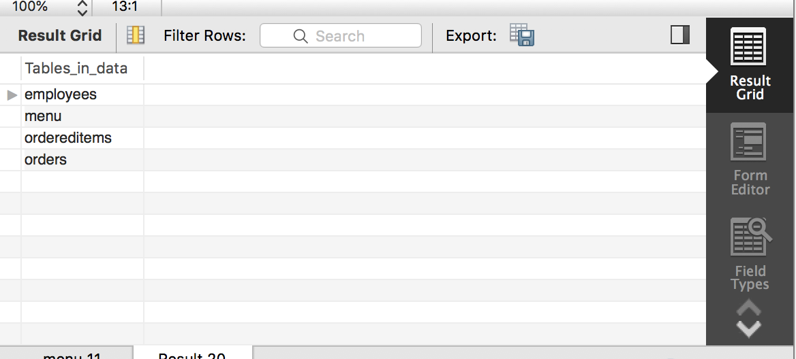
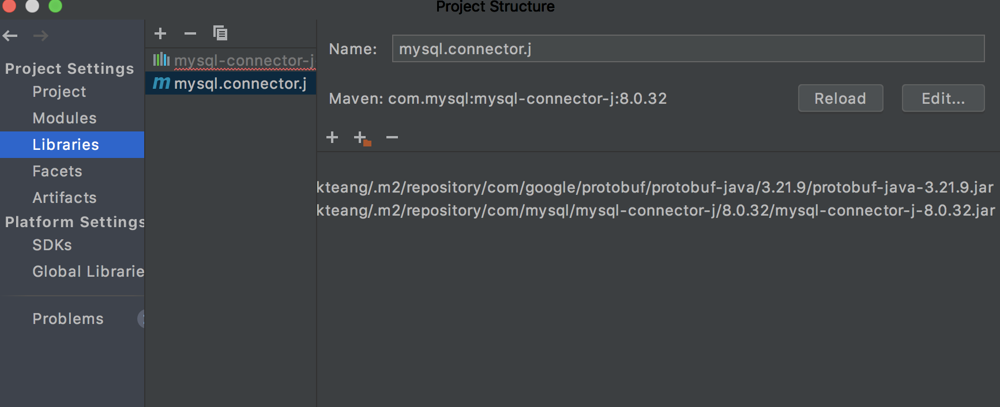

# Project Abstract
A Point-of-Sale System (PoS) is a computer system where the customer makes payment for goods or services that are offered 
by your company. It is widely used in the restaurant industries, making restaurateurs and employees much easier in 
sending orders to the kitchen staff and improving the workflow. It is also capable of tracking restaurant inventory as 
well as showing how the restaurant is performing over a specific period of time. The servers can easily create an order 
ticket through the main computer and send it to each designated station allowing the kitchen staff to work efficiently.

# Below are some main features for this program: 
- Add items to customer's order. 
- Delete items from customer's order. 
- Update quantities 
- Take customer's payment. 
- Create a ticket for the customer’s order and send the information to the kitchen printers or tablets. 
- Show which menu items have the best conversion rates (best-selling menu items). 
- Check the total sales at any specific date. 
- Void a specific ticket 
- Issuing refund on any order/individual items 
- Allow employees to clock-in 
- Show restaurant performance within specific time range. 

# Start up Page 

-

# UML Diagram

-

# Database Managements

-
These are the data table that are using in this program.

# Required resources
In order to run this program you will need to install a few things:  
- 
- Download the latest binary from the Release section on the right on GitHub.  
- Install [MySQL Community Server](https://dev.mysql.com/downloads/mysql/) in order to establish your local server.
- Install [MySQL Workbench](https://dev.mysql.com/downloads/workbench/) in order to control your data in the database.
- Download [MySQL Connector Java](https://dev.mysql.com/downloads/connector/j/) as "Platform Independent" and include that in your library of your preferred IDE.

-
This is how your IDE is able to communicate with the database.

# How to contribute
Follow this project board to know the latest status of the project: [https://github.com/orgs/cis3296s23/projects/69/views/1](https://github.com/orgs/cis3296s23/projects/69/views/1)  

### How to build
- Use this Github repository.
- Configure the database credentials.
- From the database, use SQL to import the data.
- Run the project through InteliJ 11 IDE or the command prompts.
- Specify what branch to use for a more stable release or for cutting edge development.  
- Don't forget to add all the required resources.
- Compile and run the main.java file.
- After that, the application should start. 

### Documentation
- This project supports JavaDoc documentation generation.
- To generate the document in the IntelliJ IDE,
  1. Open the project in IntelliJ
  2. In the navigation bar, navigate to: Tools > Generate JavaDoc...
  3. Select a directory to write the document to in the "Output Directory" field
  4. (Optional) Select "Open generated documentation in browser" to immediately open the document upon generation
  5. Select "Generate"
  
  Once the generation is complete, the document should be in the directory that you specified in Step 3. If you followed Step 4, the document will have     opened your default browser. If not, navigate to the directory that holds the generated JavaDoc and open the "index.html" file.
